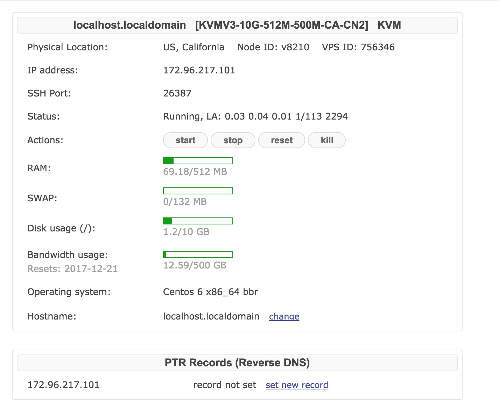
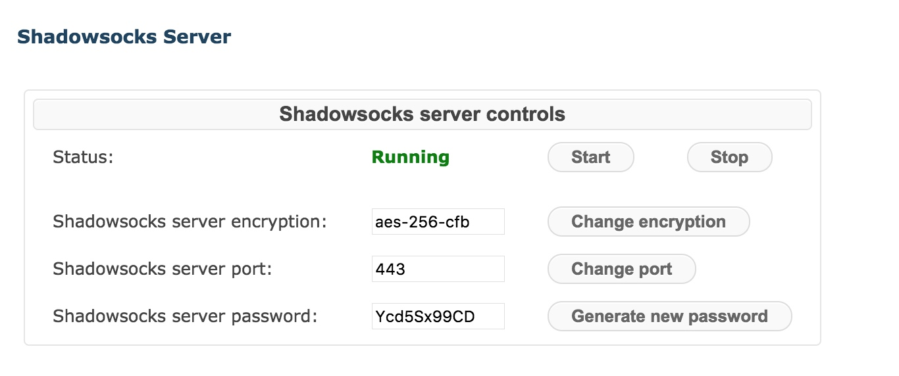

# VPS配置 
https://bandwagonhost.com/
Your temporary root password: Fox225225
Your SSH port: 26387
注意mac版secureCRT登录避免每次输入密码，要在preferences不勾选use keychain
##安装NVM & node
https://github.com/creationix/nvm#install-script
1.`curl -o- https://raw.githubusercontent.com/creationix/nvm/v0.33.6/install.sh | bash`
2.`重新打开一个shell窗口`
3.`nvm install 8.9.1`
##安装mongodb

##客户端下载： 
https://shadowsocks.org/en/download/clients.html

##OS & Shadowsocks

