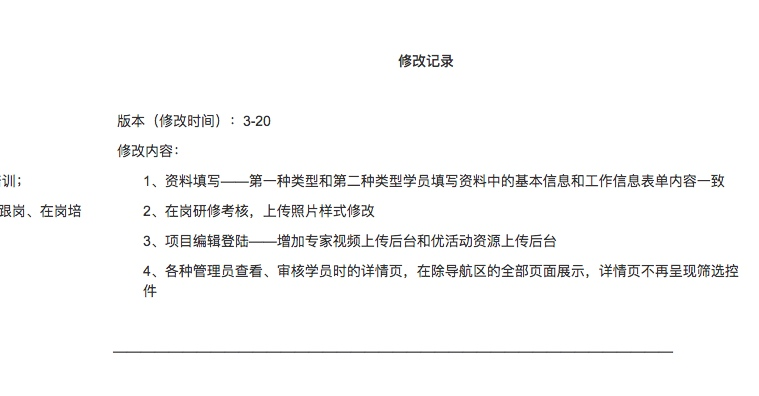

#项目资料归档> > 
##黑龙江工作坊项目坊主考核个性化
1、需求背景      1
   同吉林工作坊项目坊主考核相同，但使用17平台，故需要针对前段页面个性化开发
2、页面demo
   在线地址：https://5m4vj0.axshare.com
   wiki地址：http://wiki.yanxiu.com/pages/viewpage.action?pageId=12328265
3、时间排期
   如会议沟通，周四下班前3.1提测，下周二3.6上线
   有什么问题随时沟通，感谢
4.接口
    http://wiki.yanxiu.com/pages/viewpage.action?pageId=12322770
    现在测试在30.73上
    用2393项目的用户就行,JYY04443@yanxiu.com/123456
##云南幼儿园项目

http://fedev.yanxiu.com/projects/azshara/?tab=readme
http://fedev.yanxiu.com/projects/azshara/?tab=readme

CMS: http://cmspx.yanxiu.com/cms/webapp/sign_in.jsp
     zhangsongpu/zhangsongpu

3.产品修改

发票列表增加 发票类型  列 筛选框

为什么加scoped 没样式

联调后台 问题记录
1.导出接口
2.县市字段改变

支付相关
原接口：http://wiki.yanxiu.com/pages/viewpage.action?pageId=10520027

1255 测试账号（73）

学员：

XY00273667@yanxiu.com
XY00273669@yanxiu.com
XY00273670@yanxiu.com
XY00273671@yanxiu.com


坊主：

JYY22018@yanxiu.com
JYY22019@yanxiu.com
JYY22020@yanxiu.com
JYY22021@yanxiu.com
JYY22022@yanxiu.com
JYY22023@yanxiu.com
JYY22024@yanxiu.com
JYY22025@yanxiu.com
JYY22026@yanxiu.com
JYY22027@yanxiu.com
JYY22028@yanxiu.com
JYY22029@yanxiu.com
JYY22030@yanxiu.com
JYY22031@yanxiu.com
JYY22032@yanxiu.com

定位scroll ，guide-content搜

