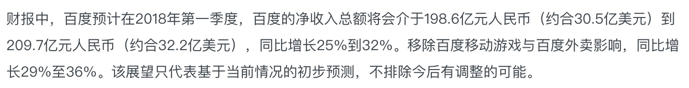
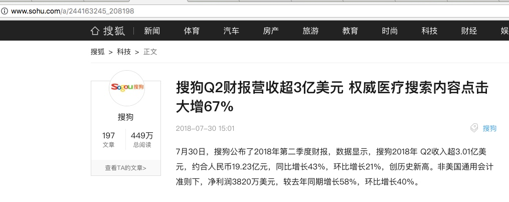

# 百度分析
百度营收：（财报后涨跌正相关于实际营收与分析师预期的差值）
    17Q2(0727)  17Q3(1026)  17Q4(0213)  18Q1(0426)
营收   小超1rmb     小降2       小超5       小超6
涨跌   +10%        -8%         +4.5%      +5.5%
实际   208.7       234.9       235.6      209.1
分析   207.9       236.4       230.2      202.8         255.6
展望204.7-209.8 231.3-237.5 222.3-234.1 198.6-209.7 249.1-261.9
汇率   6.74        6.64         6.34     6.33
17Q1汇率6.89   

    17Q1(0727)  17Q3(1026)  17Q4(0213)  18Q1(0426)
营收   小超     小降2       小超5       小超6
涨跌            -8%         +4.5%      +5.5%
实际   168.9       234.9       235.6      209.1
分析   167       236.4       230.2      202.8         255.6
展望164.8-170.3 231.3-237.5 222.3-234.1 198.6-209.7 249.1-261.9
汇率   6.86           6.64         6.34     6.33
优质期权

