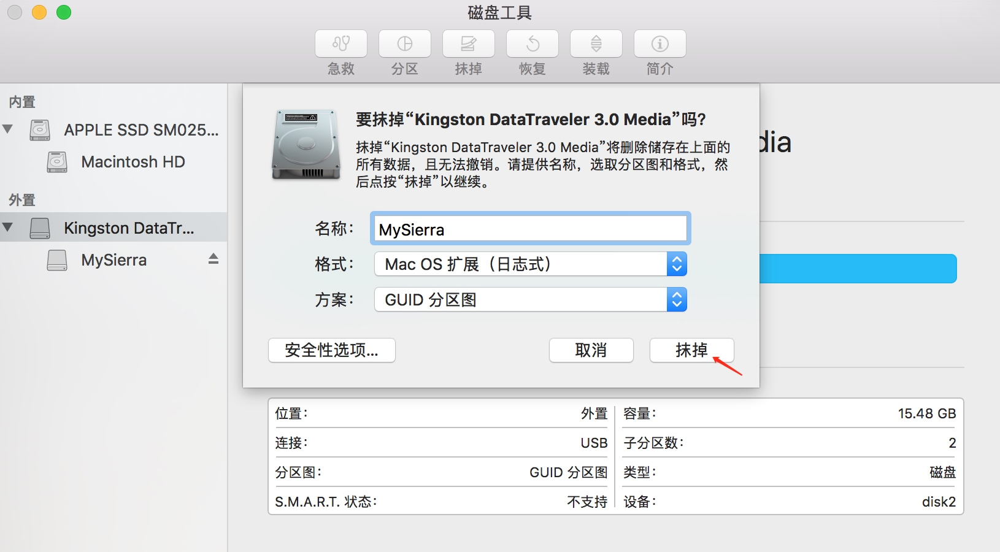
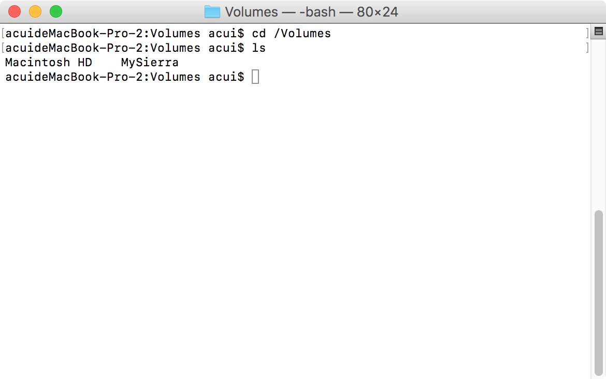
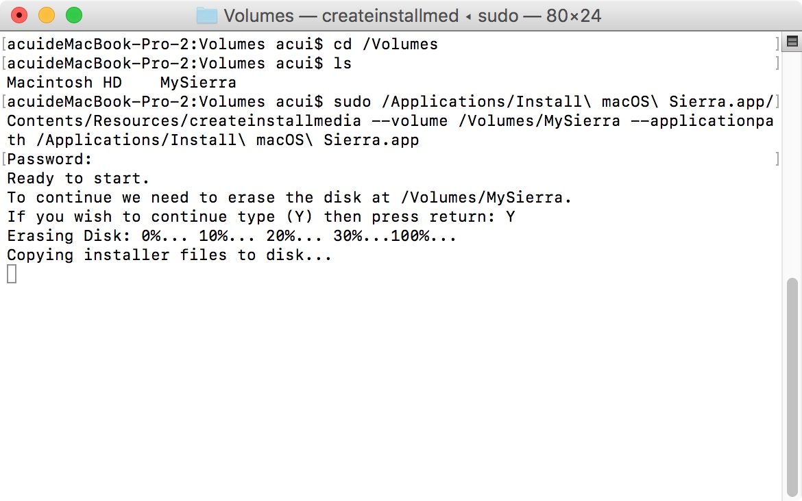

# U盘安装 macOS(创建可引导的 macOS 安装器)
##1.格式化U盘为指定格式

##2.检查U盘是否挂载

##3.使用命令行创建可引导安装器（注意，MySierra为格式化U盘时使用的名称）
sudo /Applications/Install\ macOS\ Sierra.app/Contents/Resources/createinstallmedia --volume /Volumes/MySierra --applicationpath /Applications/Install\ macOS\ Sierra.app

##4.使用启动管理器选择U盘启动
按下开机键后，长按Option键(此过程中可以选择磁盘工具格式化硬盘)
##5.遇到的坑
被安装的MBP时间调到了2028年，安装时候出现“这个‘安装 macOS Sierra’应用程序副本已损坏”，其实不是文件损坏，是Apple限制了软件安装策略，过于陈旧的版本不原装，在终端运行命令将时间修改为2017年即可: date 122012102017.30
新装自己的1398，好巧用了10.24G

