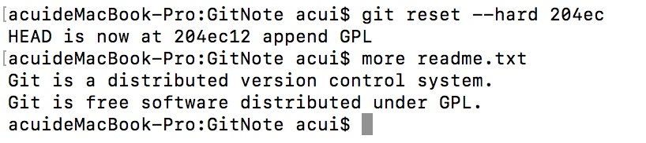

# Git学习笔记
参考：https://www.liaoxuefeng.com/wiki/0013739516305929606dd18361248578c67b8067c8c017b000
##1.Git简介
Git是目前世界上最先进的分布式版本控制系统。
Linus花了两周时间自己用C写了一个分布式版本控制系统，这就是Git。
Git极其强大的分支管理，把SVN等集中式版本管理系统远远抛在了后面。
##2.安装Git
macOS自带
##3.创建版本库(Unix的哲学是“没有消息就是好消息”)
git config --global user.name "Your Name"
git config --global user.email "email@example.com"

git init

touch readme.txt
echo "Git is a version control system." >> readme.txt 
echo "Git is free software." >> readme.txt

git add readme.txt 
git commit -m "wrote a readme file"
##4.时光机穿梭
vi readme.txt
git status
git add readme.txt 
git commit -m "add distributed"
git status
###4.1.版本回退
vi readme.txt
git add .
git commit -m "append GPL"
git log
git log --pretty=oneline
git reset --hard HEAD^  ## HEAD^^ HEAD^^^ HEAD-100
git reset --hard 204ec

git reflog
###4.2.工作区和暂存区
 

