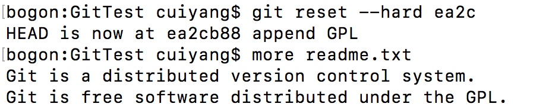
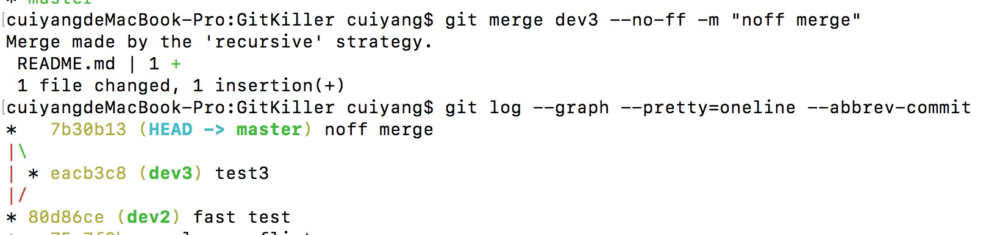
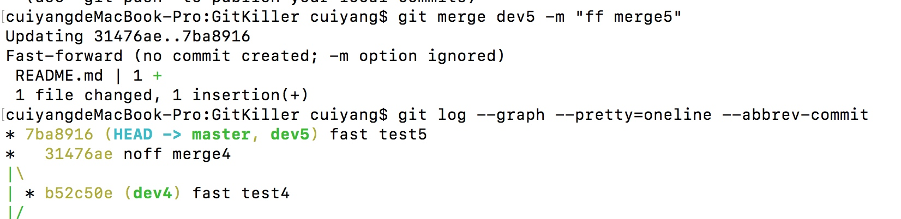

# Git学习笔记
参考：https://www.liaoxuefeng.com/wiki/0013739516305929606dd18361248578c67b8067c8c017b000
##1.Git简介
Git是目前世界上最先进的分布式版本控制系统。
Linus花了两周时间自己用C写了一个分布式版本控制系统，这就是Git。
Git极其强大的分支管理，把SVN等集中式版本管理系统远远抛在了后面。
##2.安装Git
macOS自带
git config --global user.name "Your Name"
git config --global user.email "email@example.com"
##3.创建版本库(Unix的哲学是“没有消息就是好消息”)
git init

touch readme.txt
echo "Git is a version control system." >> readme.txt 
echo "Git is free software." >> readme.txt

git add readme.txt 
git commit -m "wrote a readme file"
##4.时光机穿梭
vi readme.txt
git status
git add readme.txt 
git commit -m "add distributed"
git status
###4.1.版本回退
vi readme.txt
git add .
git commit -m "append GPL"
git log
git log --pretty=oneline
git reset --hard HEAD^  ## HEAD^^ HEAD^^^ HEAD-100
more readme.txt
git reset --hard 204ec

git reflog
###4.2.工作区(Working Directory)/版本库(Repository)/暂存区(stage)
工作区 -add-> 暂存区 -commit-> 分支
echo "Git has a multable index called stage." >> readme.txt 
touch LICENSE
echo "GPL LICENSE" >> LICENSE 
git status
git add readme.txt LICENSE
git status
git commit -m "understand how stage works"
###4.3.管理修改
echo "Git tracks changes" >> readme.txt
git add readme.txt 
git status

vi readme.txt 
git commit -m "Git tracks changes"
git status
git diff HEAD -- readme.txt 
git add
git commit -m "commit add"
###4.4.撤销修改
1.直接丢弃工作区的修改时，用命令
git checkout -- file
2.添加到了暂存区时，想丢弃修改，分两步，第一步用命令git reset HEAD <file>，就回到了场景1，第二步按场景1操作
3.已经提交了不合适的修改到版本库时，想要撤销本次提交，git reset --hard HEAD^，不过前提是没有推送到远程库 
###4.5.删除文件
rm file
git rm file 
git commit -m ""

工作区 -add-> 暂存区 -commit-> 分支
工作区 <-(git checkout -- file)- 暂存区 <-(git reset HEAD <file>)- 分支
工作区 <---(git reset --hard  HEAD^)--- 分支
##5.远程仓库
ssh-keygen -t rsa -C "youremail@example.com"
###5.1.添加远程库
cd GitTest 
git remote add origin https://github.com/getlinerm/GitTestOnline.git ##origin为远程库的别名
git push -u origin master ## union,仅第一次用

github.com: getlinerm/fox225225
###5.2.从远程库克隆
git clone git@github.com:getlinerm/GitKiller.git
##6.分支管理
创建分支的好处：保存自己每日的进度，同时不影响同事的开发。
###6.1.创建与合并分支
git checkout -b dev
git branch
echo "Crating a new branch is quick." >> README.md
git add .
git commit -m "branch test"
git checkout master
git merge dev
git branch -d dev
###6.2.解决冲突
手动解决
git log --graph --pretty=oneline --abbrev-commit
###6.3.分支管理策略
git merge dev3 --no-ff -m "ff merge5"  ##(--no-ff 不保留分支记录)

###6.4.Bug分支
git stash
git stash list
git stash pop
git stash apply stash@{0}
###6.5.Feature分支
 git branch -D feature-has-not-been-merged ##(强行删除未合并的分支)
###6.6.多人协作
1.查看远程库信息，使用git remote -v；
2.在本地创建和远程分支对应的分支，使用如下命令，本地和远程分支的名称最好一致，
git checkout -b branch-name origin/branch-name；
3.从本地推送分支，使用git push origin branch-name，如果推送失败，先用git pull抓取远程的新提交，如果有冲突，要先处理冲突。
4.建立本地分支和远程分支的关联，使用
git branch --set-upstream-to <branch-name> origin/<branch-name>；
###6.7.Rebase
git pull
git status
git log
git rebase
##7.标签管理
标签也是版本库的一个快照
###7.1.创建标签
git tag v1.0
git tag

git log --pretty=oneline --abbrev-commit
git tag v0.9 f52c633
git show v0.9
git tag 1094adb -a v0.1 -m "version 0.1 released"
###7.1.操作标签
git push origin v1.0
git push origin --tags
git tag -d v0.9
git push origin :refs/tags/v0.9
##8.使用GitHub
twbs/bootstrap -> my/bootstrap ->local/bootstrap
pull request
##9.使用码云
https://gitee.com/
##10.自定义Git
###10.1.忽略特殊文件
创建 .gitignore
强制提交 git add -f App.class
查看ignore规则 git check-ignore -v 2.txt
###10.2.配置别名
cd ~
more ./.gitconfig 
git config --global alias.st status

cd ./.git/config
###10.3.搭建Git服务器
后续

http://git-scm.com